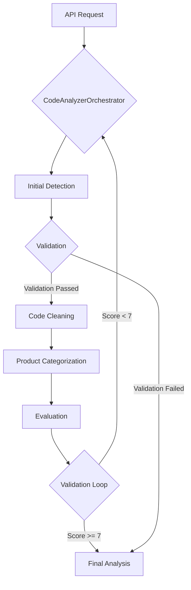

# Health Scoring Agent

The Health Scoring Agent is a sophisticated, multi-agent system designed to analyze and evaluate code samples for quality, correctness, and adherence to best practices. It uses a combination of rules-based logic and large language models (LLMs) to provide a comprehensive and nuanced assessment of code health. This system is built for developers, quality assurance teams, and technical managers who need a consistent and automated way to measure code quality.

## 📖 Table of Contents

- [Health Scoring Agent](#health-scoring-agent)
  - [📖 Table of Contents](#-table-of-contents)
  - [The Problem](#the-problem)
  - [The Solution](#the-solution)
  - [✨ Key Features](#-key-features)
  - [🏗️ System Architecture](#️-system-architecture)
    - [High-Level Flow](#high-level-flow)
    - [Orchestrator](#orchestrator)
    - [Agents](#agents)
    - [Tools](#tools)
  - [🚀 Getting Started](#-getting-started)
    - [Prerequisites](#prerequisites)
    - [Installation and Setup](#installation-and-setup)
  - [☁️ Deployment](#️-deployment)
  - [⚙️ Configuration](#️-configuration)
    - [Local Development (`.env` file)](#local-development-env-file)
    - [Cloud Run Deployment (`cloudbuild.yaml`)](#cloud-run-deployment-cloudbuildyaml)
  - [↔️ API Reference](#️-api-reference)
    - [`POST /analyze`](#post-analyze)
    - [`POST /analyze_github_link`](#post-analyze_github_link)
    - [`POST /validate`](#post-validate)
  - [📁 Project Structure](#-project-structure)
  - [🤝 Contributing](#-contributing)
  - [📄 License](#-license)

## The Problem

Evaluating the quality of code is a complex and often subjective task. Manual code reviews are time-consuming and can be inconsistent. Automated tools can help, but they often lack the nuanced understanding of a human expert. This can lead to a number of challenges:

- **Inconsistent Quality:** Without a standardized way to measure code health, the quality of code can vary widely across a project or organization.
- **Time-Consuming Reviews:** Manual code reviews are a bottleneck in the development process, slowing down the delivery of new features.
- **Lack of Actionable Feedback:** Many automated tools provide generic feedback that is not specific enough to be actionable.

## The Solution

The Health Scoring Agent addresses these challenges by providing a consistent, automated, and expert-level analysis of code quality. It uses a multi-agent system to mimic the process of a human code review, with different agents specializing in different aspects of the analysis. The system provides a detailed, actionable report that can be used to improve the quality of the code.

## ✨ Key Features

- **Multi-Agent Architecture:** The system is built on a modular, multi-agent architecture, where each agent is a specialized expert responsible for a specific aspect of the analysis (e.g., code quality, runnability, API correctness). This design allows for a clear separation of concerns, making the system easy to extend with new capabilities and maintain over time.
- **Iterative Refinement with Self-Validation:** The system includes a unique self-validation workflow. After an initial analysis is performed, a separate, independent agentic workflow validates the output. This "peer review" model uses Google Search to fact-check the claims made by the initial evaluation. If the validation score is below a configurable threshold, the entire analysis is re-run, with the validation feedback provided to the original agents to improve their work. This iterative process ensures a high-quality, reliable final score.
- **Advanced Prompt Engineering:** The LLMs are guided by meticulously engineered prompts that establish specific expert personas (e.g., "Principal Engineer," "Senior DevOps Engineer"). These prompts provide detailed context, step-by-step instructions, and specify a structured output format (JSON), leading to more consistent, accurate, and actionable analysis.
- **Hybrid Rules-Based and LLM System:** The system combines the strengths of deterministic, rules-based logic with the flexibility of LLMs. For tasks like product categorization, a sophisticated, rules-based engine is used first for speed and accuracy, with an LLM fallback for ambiguous cases. This hybrid approach ensures both reliability and the ability to handle complex scenarios.
- **Automated Code Cleaning:** Before analysis, a utility removes all comments from the code. This ensures that the evaluation is focused purely on the executable code, preventing comments from influencing the outcome and standardizing the input for the analytical agents.
- **Simple Web Interface:** A user-friendly web interface is included for submitting code samples for analysis. This provides an intuitive way to interact with the system and view the results without needing to use the API directly.
- **Detailed and Actionable Reporting:** The final output is a comprehensive JSON object that includes an overall health score, a detailed breakdown of each evaluation criterion, and a list of specific, actionable recommendations for improvement. This allows developers to quickly identify and address issues in their code.

## 🏗️ System Architecture

The Health Scoring Agent is built on a modular, multi-agent architecture designed for clarity, extensibility, and maintainability.

### High-Level Flow

The following diagram illustrates the high-level flow of the system:



1. **API Request:** A user submits code via a REST API endpoint (`/analyze` or `/analyze_github_link`).
2. **Main Orchestrator (`CodeAnalyzerOrchestrator`):** This orchestrator manages the primary analysis workflow.
   - **Phase 1: Initial Analysis:** A parallel agent performs initial tasks like language detection and region tag extraction.
   - **Phase 2: Core Evaluation:** A sequential agent performs a deep analysis of the code, covering quality, runnability, and API correctness. A separate agent then formats this analysis into a structured JSON object.
3. **Validation Loop (API Layer):**
   - The API triggers a secondary `ValidationOrchestrator`.
   - An `EvaluationVerificationAgent` uses Google Search to verify the claims made in the original evaluation.
   - A `ValidationFormattingAgent` structures the verification findings into a score (1-10) and detailed reasoning.
4. **Iterative Refinement:**
   - If the validation score is below a set threshold (e.g., 7/10), the API rejects the analysis.
   - It then re-runs the entire `CodeAnalyzerOrchestrator` workflow, passing the validation reasoning as feedback to the initial agents.
   - This loop continues until the analysis quality is satisfactory or a maximum number of attempts is reached.

### Orchestrator

The `CodeAnalyzerOrchestrator` is the central coordinator of the system. It manages the sequence of operations, ensuring that each agent performs its function at the appropriate time. It uses a combination of sequential and parallel agent execution to optimize the workflow.

### Agents

The system is composed of various specialized agents, each an expert in its domain:

- **Analysis Agents:** These agents perform the core evaluation of the code.
  - `CodeQualityAgent`: Assesses code for style, clarity, and adherence to best practices.
  - `RunnabilityAgent`: Evaluates whether the code is runnable and complete.
  - `ApiAnalysisAgent`: Checks for the correct usage of APIs and libraries.
- **Categorization Agents:** These agents handle initial classification tasks.
  - `DeterministicLanguageDetectionAgent`: Identifies the programming language.
  - `DeterministicRegionTagAgent`: Extracts region tags from the code.
  - `ProductCategorizationAgent`: Determines the product or technology the code relates to.
- **Formatting Agents:** These agents ensure the output is in the correct format.
  - `JsonFormattingAgent`: Converts the raw text analysis into a structured JSON object.
- **Validation Agents:** These agents are part of the secondary validation workflow.
  - `EvaluationVerificationAgent`: Fact-checks the initial analysis using web searches.
  - `ValidationFormattingAgent`: Structures the validation feedback.

### Tools

The agents use a variety of tools to perform their analysis:

- **`code_cleaning`:** A utility to strip comments and other non-executable content from code before analysis.
- **`product_categorization`:** A rules-based engine with an LLM fallback for identifying the product associated with a code sample.
- **`google_search`:** A tool that allows agents to perform web searches to verify information about APIs, libraries, and best practices.

## 🚀 Getting Started

Follow these instructions to set up and run the Health Scoring Agent locally.

### Prerequisites

- **Python 3.12 or higher.**
- **Google Cloud SDK (`gcloud`)**: Required for deploying to Google Cloud.
- **A Google Cloud Project**: Required for deployment, with the **Vertex AI API** enabled.
- **Authentication**:
  - For **local development**, a Google AI API Key is the simplest way to authenticate.
  - For **deployment to Google Cloud**, the application uses Application Default Credentials (ADC), so the service account will need the appropriate IAM roles.

### Installation and Setup

1. **Clone the repository:**

    ```bash
    git clone https://github.com/joeshirey/HealthScoringAgent.git
    cd HealthScoringAgent
    ```

2. **Create and activate a virtual environment:**

    This isolates the project dependencies from your system's Python environment.

    ```bash
    python3 -m venv .venv
    source .venv/bin/activate
    ```

    *On Windows, use `.venv\Scripts\activate`.*

3. **Install dependencies:**

    The project uses `uv` for fast dependency management. The dependencies are listed in `pyproject.toml`.

    ```bash
    pip install uv
    uv pip install -e .
    ```

    *The `-e` flag installs the project in "editable" mode, which is useful for development.*

4. **Set up environment variables for Local Development:**

    For local development, the application is configured to use a Google AI API key.

    ```bash
    # Copy the sample environment file to a new .env file
    cp .env.sample .env
    ```

    Now, open the `.env` file in a text editor and add your credentials. The other variables are pre-configured for a standard setup.

    ```env
    # For local development, set your Google AI API Key
    GEMINI_API_KEY="YOUR_GEMINI_API_KEY"

    # The rest of the variables are primarily for Cloud Run deployment
    # but are included here for completeness.
    GOOGLE_CLOUD_PROJECT="your-project-id"
    GOOGLE_CLOUD_LOCATION="us-central1"
    GOOGLE_GENAI_USE_VERTEXAI="true"
    GEMINI_PRO_MODEL="gemini-2.5-pro"
    GEMINI_FLASH_MODEL="gemini-2.5-flash"
    GEMINI_FLASH_LITE_MODEL="gemini-2.5-flash-lite"
    MAX_VALIDATION_LOOPS=3
    ```

5. **Run the application:**

    The application is served using `uvicorn`. The `Dockerfile` is configured to run on port `8080` to match Cloud Run's default.

    ```bash
    uvicorn api.main:app --host 0.0.0.0 --port 8080
    ```

    The API will now be available at `http://0.0.0.0:8080`, and the web interface at `http://0.0.0.0:8080/ui`.

## ☁️ Deployment

This application is designed to be deployed to **Google Cloud Run** using an automated CI/CD pipeline with **Cloud Build**.

The `cloudbuild.yaml` file in the root of the repository defines all the necessary steps to build the Docker container, push it to Artifact Registry, and deploy it to Cloud Run.

For detailed, step-by-step instructions on how to set up your Google Cloud project and run the deployment, please see the **[DEPLOYMENT.md](DEPLOYMENT.md)** file.

## ⚙️ Configuration

The application is configured via environment variables.

### Local Development (`.env` file)

For local development, create a `.env` file (by copying `.env.sample`) and set the following:

- `GEMINI_API_KEY`: **Required.** Your Google AI API Key for authentication.

### Cloud Run Deployment (`cloudbuild.yaml`)

For deployment, the following environment variables are set directly in the `cloudbuild.yaml` file and passed to the Cloud Run service. You can edit the `cloudbuild.yaml` or provide substitutions during the build process to change these values.

- `GOOGLE_CLOUD_PROJECT`: Your Google Cloud project ID.
- `GOOGLE_CLOUD_LOCATION`: The region where your service is deployed (e.g., `us-central1`).
- `GOOGLE_GENAI_USE_VERTEXAI`: Set to `"true"` to use the Vertex AI backend, which is recommended for production.
- `GEMINI_PRO_MODEL`: The name of the Gemini Pro model to use.
- `GEMINI_FLASH_MODEL`: The name of the Gemini Flash model to use.
- `GEMINI_FLASH_LITE_MODEL`: The name of the Gemini Flash Lite model to use.
- `MAX_VALIDATION_LOOPS`: The maximum number of times the self-validation loop can run.
- `GITHUB_FETCH_TIMEOUT`: The timeout in seconds for fetching code from GitHub.

## ↔️ API Reference

The Health Scoring Agent provides a simple REST API for analyzing code samples.

### `POST /analyze`

Analyzes a code sample and returns a detailed analysis of its health.

- **Request Body:**
  - `code` (string, required): The raw code sample to analyze.
  - `github_link` (string, optional): A GitHub link to the code sample, used for context.
- **Response Body:**
    A JSON object containing the final analysis and a history of validation attempts.
  - `analysis`: The full, detailed health score analysis from the final, successful iteration.
  - `validation_history`: A list of objects, where each object represents a validation attempt and contains:
    - `validation_score`: A score from 1-10 on the quality of the analysis.
    - `reasoning`: A detailed explanation for the validation score.

**Example Request:**

```bash
curl -X POST http://localhost:8090/analyze \
-H "Content-Type: application/json" \
-d '{
    "code": "def hello_world():\n    print(\"Hello, world!\")"
}'
```

**Example Response:**

```json
{
  "analysis": {
    "language": "Python",
    "product_name": "Unknown",
    "product_category": "Unknown",
    "region_tags": [
      ""
    ],
    "assessment": {
      "overall_score": 8,
      "overall_summary": "The code is simple and clear, but lacks error handling and documentation.",
      "criteria_breakdown": [
        {
          "criterion_name": "runnability_and_configuration",
          "score": 10,
          "reasoning": "The code is runnable as is.",
          "recommendations_for_llm_fix": []
        },
        {
          "criterion_name": "language_best_practices",
          "score": 8,
          "reasoning": "The code follows basic Python conventions.",
          "recommendations_for_llm_fix": []
        }
      ]
    }
  },
  "validation_history": [
    {
      "validation_score": 8,
      "reasoning": "The analysis is accurate and provides good feedback.",
      "evaluation_json": {
        "language": "Python",
        "product_name": "Unknown",
        "product_category": "Unknown",
        "region_tags": [
          ""
        ],
        "assessment": {
          "overall_score": 8,
          "overall_summary": "The code is simple and clear, but lacks error handling and documentation.",
          "criteria_breakdown": [
            {
              "criterion_name": "runnability_and_configuration",
              "score": 10,
              "reasoning": "The code is runnable as is.",
              "recommendations_for_llm_fix": []
            },
            {
              "criterion_name": "language_best_practices",
              "score": 8,
              "reasoning": "The code follows basic Python conventions.",
              "recommendations_for_llm_fix": []
            }
          ]
        }
      }
    }
  ]
}
```

### `POST /analyze_github_link`

Analyzes a code sample from a GitHub link.

- **Request Body:**
  - `github_link` (string, required): The direct GitHub link to the code sample.
- **Response Body:**
    Same as the `/analyze` endpoint.

**Example:**

```bash
curl -X POST http://localhost:8090/analyze_github_link \
-H "Content-Type: application/json" \
-d '{
    "github_link": "https://github.com/googleapis/google-cloud-node/blob/main/packages/google-cloud-alloydb/samples/quickstart.js"
}'
```

### `POST /validate`

Validates an existing evaluation against the source code from a GitHub link. This endpoint is useful for testing the validation workflow independently.

- **Request Body:**
  - `github_link` (string, required): The GitHub link to the code sample.
  - `evaluation` (object, required): The JSON object from a previous analysis to be validated.
- **Response Body:**
    A JSON object containing the validation score and reasoning.
  - `validation_score`: A score from 1-10 on the quality of the analysis.
  - `reasoning`: A detailed explanation for the validation score.

**Example:**

```bash
curl -X POST http://localhost:8090/validate \
-H "Content-Type: application/json" \
-d '{
    "github_link": "https://github.com/googleapis/google-cloud-node/blob/main/packages/google-cloud-alloydb/samples/quickstart.js",
    "evaluation": { "score": 8, "reasoning": "The code is good." }
}'
```

## 📁 Project Structure

The project is organized into the following directories to ensure a clean separation of concerns:

- `agentic_code_analyzer/`: The core application logic.
  - `agents/`: Contains the individual agents that make up the system. Each agent is a Python class responsible for a specific task.
  - `prompts/`: Contains the prompt templates in Markdown (`.md`) files. These are engineered to provide clear instructions, establish a specific persona for the LLM, and define the expected output format.
  - `tools/`: Contains tools and utilities used by the agents, such as the code cleaning utility and the product categorization engine.
- `api/`: The FastAPI application that exposes the system via a REST API and a web interface.
  - `ui/`: Contains the static files (HTML, CSS, JavaScript) for the web interface.
- `config/`: Contains configuration files, such as logging settings.
- `docs/`: Contains high-level project documentation, including product requirements and technical design documents.
- `tests/`: Contains unit and integration tests for the application.

## 🤝 Contributing

Contributions are welcome! We are always looking for ways to improve the Health Scoring Agent. Please see the [CONTRIBUTING.md](CONTRIBUTING.md) file for guidelines on how to contribute.

## 📄 License

This project is licensed under the Apache 2.0 License. See the [LICENSE](LICENSE) file for details.
