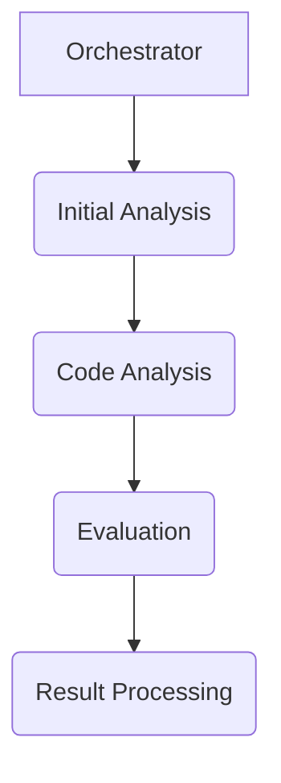
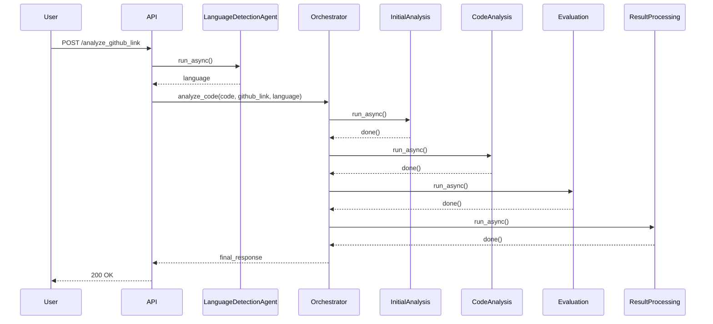

# Technical Design Document: HealthScoringAgent

## 1. Introduction

This document provides a detailed technical overview of the HealthScoringAgent, a multi-agent system for code analysis. It covers the system architecture, the design of the individual agents, and the data models used.

## 2. System Architecture

The HealthScoringAgent is built on a modular, multi-agent architecture using the Google Agent Development Kit (ADK). The system is designed as a sequential pipeline of agents, with some steps in the pipeline executing in parallel to improve performance.

The main components of the system are:

*   **Orchestrator:** The central component that manages the workflow and coordinates the execution of the other agents.
*   **Agents:** A collection of specialized agents, each responsible for a specific aspect of the analysis.
*   **Tools:** A set of tools and utilities that are used by the agents to perform their tasks.
*   **Prompts:** A collection of prompt templates that are used to guide the large language models.



### 2.1. Workflow

The analysis workflow is as follows:

1.  **API Layer:**
    *   **Language Detection:** The API first detects the programming language of the code sample using the `LanguageDetectionAgent`.
2.  **Initial Analysis (Parallel):**
    *   **Region Tag Extraction:** Extracts the region tags from the code sample.
    *   **Product Categorization:** Categorizes the code sample into a specific Google Cloud product.
3.  **Code Analysis (Parallel):**
    *   **Code Quality:** Analyzes the code for quality, including formatting, consistency, and adherence to language best practices.
    *   **API Analysis:** Analyzes the code for API effectiveness and correctness.
    *   **Clarity and Readability:** Analyzes the code for clarity, readability, and fitness for LLM training.
    *   **Runnability:** Analyzes the code for runnability and configuration.
3.  **Evaluation (Sequential):**
    *   **Initial Analysis:** Performs a detailed analysis of the code, using web grounding to ensure the information is accurate and up-to-date.
    *   **JSON Formatting:** Formats the analysis into a clean, structured JSON object.
4.  **Result Processing:**
    *   **Result Processing:** Processes the results of the analysis and generates the final JSON output.



## 3. Agent Design

Each agent in the system is a self-contained component with a specific responsibility. The agents are designed to be modular and reusable, and they communicate with each other through a shared session state.

### 3.1. Orchestrator

The `CodeAnalyzerOrchestrator` is a `SequentialAgent` that manages the overall workflow. It is responsible for creating the other agents and for executing them in the correct order.

### 3.2. Initial Analysis Agents

The initial analysis agents are run in parallel to improve performance.

*   **`LanguageDetectionAgent`:** An `LlmAgent` that detects the programming language of the code sample. It is recommended to use the Gemini Flash model for this task.
*   **`RegionTagExtractionAgent`:** An `LlmAgent` that extracts the region tags from the code sample. It is recommended to use the Gemini Flash model for this task.
*   **`ProductCategorizationAgent`:** A `BaseAgent` that categorizes the code sample into a specific Google Cloud product.

### 3.3. Code Analysis Agents

The code analysis agents are also run in parallel.

*   **`CodeQualityAgent`:** An `LlmAgent` that analyzes the code for quality. It is recommended to use the Gemini Flash model for this task.
*   **`ApiAnalysisAgent`:** An `LlmAgent` that analyzes the code for API effectiveness and correctness. It is recommended to use the Gemini Flash model for this task.
*   **`ClarityReadabilityAgent`:** An `LlmAgent` that analyzes the code for clarity and readability. It is recommended to use the Gemini Flash model for this task.
*   **`RunnabilityAgent`:** An `LlmAgent` that analyzes the code for runnability. It is recommended to use the Gemini Flash model for this task.

### 3.4. Evaluation Agents

The evaluation agents are run sequentially.

*   **`InitialAnalysisAgent`:** An `LlmAgent` that performs the initial, detailed analysis of the code. It is recommended to use the Gemini Pro model for this task.
*   **`JsonFormattingAgent`:** An `LlmAgent` that formats the raw text analysis into a JSON object. It is recommended to use the Gemini Flash model for this task.

### 3.5. Result Processing Agent

The `ResultProcessingAgent` is a `BaseAgent` that processes the results of the analysis and generates the final JSON output.

## 4. Configuration

The application is configured using environment variables. A `.env` file should be created in the root of the project with the following variables:

*   `GOOGLE_CLOUD_PROJECT`: Your Google Cloud project ID.
*   `GOOGLE_CLOUD_LOCATION`: The location of your Google Cloud project.
*   `GOOGLE_GENAI_USE_VERTEXAI`: Whether to use Vertex AI for the generative AI models.
*   `GEMINI_PRO_MODEL`: The name of the Gemini Pro model to use for the analysis.
*   `GEMINI_FLASH_MODEL`: The name of the Gemini Flash model to use for the analysis.

An example `.env.sample` file is provided in the root of the project.

## 5. Running the Application

To run the application in development mode with hot-reloading, use the following command:

```bash
uv run dev
```

This will start the FastAPI server on `http://0.0.0.0:8090`.

## 6. Data Models

The system uses a simple data model to represent the results of the analysis. The main data model is the `AnalysisResult`, which is a Pydantic model that contains the following information:

*   **`git_info`:** Information about the git repository where the code sample is located.
*   **`region_tags`:** The region tags that were extracted from the code sample.
*   **`evaluation_data`:** The results of the evaluation.
*   **`raw_code`:** The raw code of the code sample.