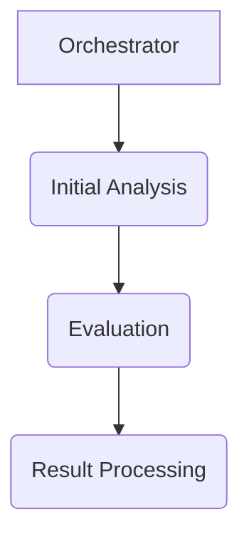
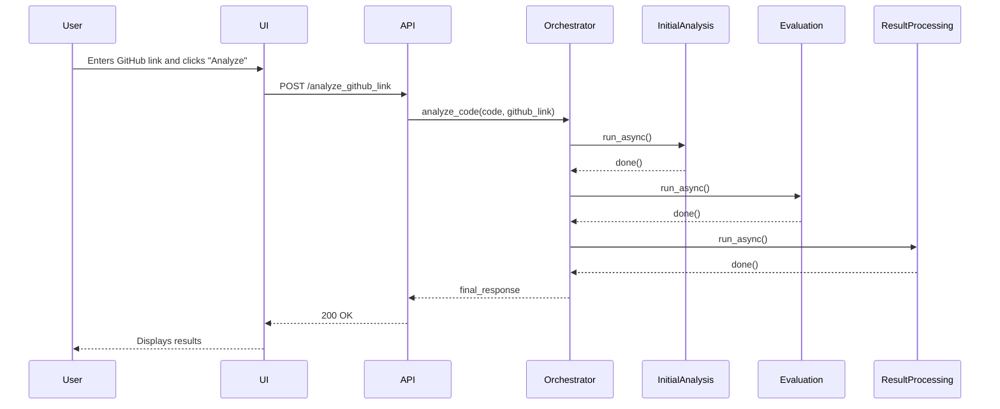

# Technical Design Document: Health Scoring Agent

## 1. Introduction

This document provides a detailed technical overview of the Health Scoring Agent, a multi-agent system for code analysis. It covers the system architecture, the design of the individual agents, the data models used, and the API and UI.

## 2. System Architecture

The Health Scoring Agent is built on a modular, multi-agent architecture using the Google Agent Development Kit (ADK). The system is designed as a sequential pipeline of agents, with some steps in the pipeline executing in parallel to improve performance.

The main components of the system are:

*   **Orchestrator:** The central component that manages the workflow and coordinates the execution of the other agents.
*   **Agents:** A collection of specialized agents, each responsible for a specific aspect of the analysis.
*   **Tools:** A set of tools and utilities that are used by the agents to perform their tasks.
*   **Prompts:** A collection of prompt templates that are used to guide the large language models.
*   **API:** A FastAPI application that provides a REST API for analyzing code samples.
*   **UI:** A simple web interface for submitting code samples for analysis.

### 2.1. Workflow

The analysis workflow is as follows:

1.  **Initial Analysis (Parallel):**
    *   **Language Detection:** Detects the programming language of the code sample.
    *   **Region Tag Extraction:** Extracts the region tags from the code sample.
    *   **Product Categorization:** Categorizes the code sample into a specific Google Cloud product.

2.  **Evaluation (Sequential):**
    *   **Initial Analysis:** Performs a detailed analysis of the code, using web grounding to ensure the information is accurate and up-to-date.
    *   **JSON Formatting:** Formats the analysis into a clean, structured JSON object.

3.  **Result Processing:**
    *   **Result Processing:** Processes the results of the analysis and generates the final JSON output.

## 3. Agent Design

Each agent in the system is a self-contained component with a specific responsibility. The agents are designed to be modular and reusable, and they communicate with each other through a shared session state.

### 3.1. Orchestrator

The `CodeAnalyzerOrchestrator` is a `SequentialAgent` that manages the overall workflow. It is responsible for creating the other agents and for executing them in the correct order.

### 3.2. Initial Analysis Agents

The initial analysis agents are run in parallel to improve performance.

*   **`LanguageDetectionAgent`:** An `LlmAgent` that detects the programming language of the code sample. It is recommended to use the Gemini Flash model for this task.
*   **`RegionTagExtractionAgent`:** An `LlmAgent` that extracts the region tags from the code sample. It is recommended to use the Gemini Flash model for this task.
*   **`ProductCategorizationAgent`:** A `BaseAgent` that categorizes the code sample into a specific Google Cloud product.

### 3.3. Evaluation Agents

The evaluation agents are run sequentially.

*   **`InitialAnalysisAgent`:** An `LlmAgent` that performs the initial, detailed analysis of the code. It is recommended to use the Gemini Pro model for this task.
*   **`JsonFormattingAgent`:** An `LlmAgent` that formats the raw text analysis into a JSON object. It is recommended to use the Gemini Flash model for this task.

### 3.4. Result Processing Agent

The `ResultProcessingAgent` is a `BaseAgent` that processes the results of the analysis and generates the final JSON output.

## 4. Data Models

The system uses a set of Pydantic models to define the structured outputs of the analysis agents. These models are defined in the `agentic_code_analyzer/models.py` file.

### 4.1. `AnalysisOutput`

This is a base model that provides a standardized structure for the output of the individual analysis agents. It includes the following fields:

*   `score`: An integer from 1-10.
*   `summary`: A brief, high-level summary of the findings.
*   `details`: A list of specific observations, issues, or recommendations.

The `CodeQualityOutput`, `ClarityReadabilityOutput`, and `RunnabilityOutput` models all inherit from this base model.

### 4.2. `EvaluationOutput`

This model defines the structure of the final output from the evaluation workflow. It includes a detailed breakdown of the analysis, including the overall compliance score, a list of criteria, and a summary of the recommended fixes.

## 5. API

The system provides a REST API for analyzing code samples. The API is built using FastAPI and is defined in the `api/main.py` file.

### 5.1. `POST /analyze`

Analyzes a code sample and returns a detailed analysis of its health.

**Request Body:**

*   `code` (string, required): The code sample to analyze.
*   `github_link` (string, optional): The GitHub link to the code sample.

### 5.2. `POST /analyze_github_link`

Analyzes a code sample from a GitHub link and returns a detailed analysis of its health.

**Request Body:**

*   `github_link` (string, required): The GitHub link to the code sample.

## 6. UI

The system includes a simple web interface for submitting code samples for analysis. The UI is built using HTML, CSS, and JavaScript and is defined in the `api/ui` directory. The UI allows users to enter a GitHub link to a code sample and view the results of the analysis.