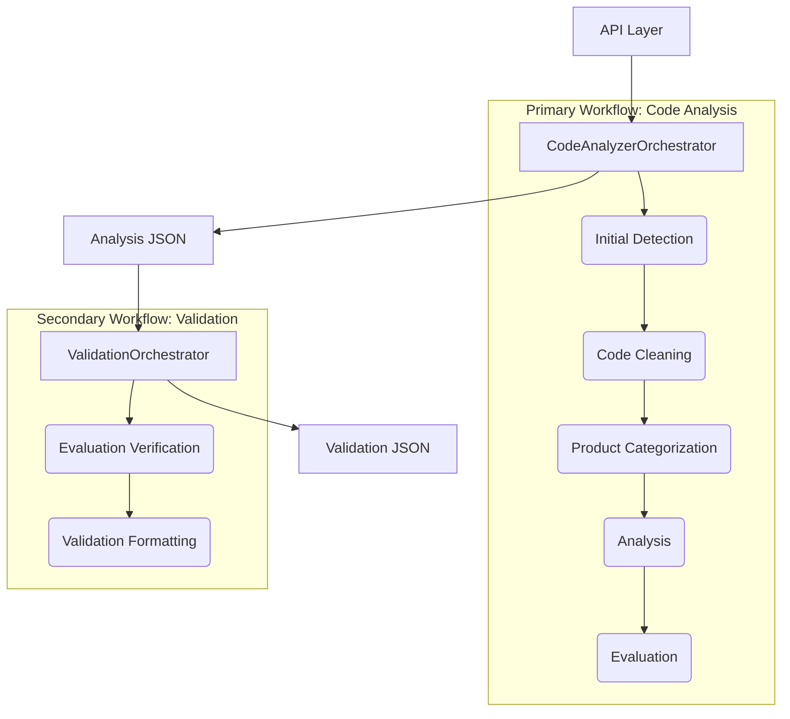
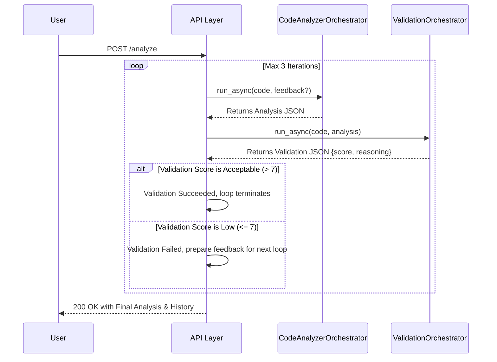

# Technical Design Document: Health Scoring Agent

## 1. Introduction

This document provides a detailed technical overview of the Health Scoring Agent, a multi-agent system for code analysis. It covers the system architecture, the design of the individual agents, the data models used, the prompt engineering strategy, and the API/UI. This document is intended for software engineers, architects, and other technical stakeholders who need to understand the inner workings of the system.

## 2. System Architecture

The Health Scoring Agent is built on a modular, multi-agent architecture using the Google Agent Development Kit (ADK). The system is designed as a sequential pipeline of agents, with some steps in the pipeline executing in parallel to improve performance.

The main components of the system are:

- **Orchestrator:** The central component that manages the workflow and coordinates the execution of the other agents.
- **Agents:** A collection of specialized agents, each responsible for a specific aspect of the analysis.
- **Prompts:** A collection of meticulously engineered prompt templates that are used to guide the large language models.
- **Tools:** A set of tools and utilities that are used by the agents to perform their tasks.
- **API:** A FastAPI application that provides a REST API for analyzing code samples.
- **UI:** A simple web interface for submitting code samples for analysis.



### 2.1. Workflow

The system's primary entry point is the `/analyze` API endpoint, which orchestrates a complex, potentially iterative workflow designed to produce a high-quality, validated analysis of a given code sample.

1. **Primary Analysis Workflow (`CodeAnalyzerOrchestrator`):** The process begins with the main analysis workflow, which is executed at least once.
   - **Initial Detection (Parallel):** The orchestrator first runs two deterministic agents in parallel to quickly gather basic metadata without incurring LLM costs.
     - `DeterministicLanguageDetectionAgent`: Identifies the programming language from the file extension.
     - `DeterministicRegionTagAgent`: Extracts all `[START ...]` and `[END ...]` tags using regular expressions.
   - **Code Cleaning:** The `CodeCleaningAgent` removes all comments from the code snippet. This focuses the subsequent LLM analysis on the functional code, preventing comments from influencing the evaluation.
   - **Product Categorization:** The `ProductCategorizationAgent` identifies the primary Google Cloud product (e.g., "Spanner", "Cloud Storage") associated with the code. It uses a fast, local search-based tool first and only falls back to an LLM call if the initial tool fails, optimizing for both speed and accuracy.
   - **Core Evaluation (Sequential):** This is a two-step process:
     1. `InitialAnalysisAgent`: An LLM agent acting as a "Principal Software Engineer" performs a comprehensive, qualitative review of the code. It is equipped with Google Search to verify API usage and best practices. It takes feedback from previous validation loops (if any) into account to improve its analysis. Its output is detailed, unstructured text.
     2. `JsonFormattingAgent`: A second, more lightweight LLM agent takes the unstructured text from the previous step and meticulously formats it into a structured JSON object that conforms to the `AnalysisResult` Pydantic model.

2. **Validation Workflow (`ValidationOrchestrator`):** After the primary analysis workflow completes, the API layer immediately initiates a validation workflow to act as a "peer review".
    - **Verification:** The `EvaluationVerificationAgent`, also acting as a "Principal Software Engineer," receives the original code and the JSON analysis from the first workflow. Its sole mission is to validate the *correctness* of the analysis. It heavily uses the `google_search` tool to fact-check every claim made about API usage, method names, parameters, and error handling. It outputs its findings as unstructured text, starting with a 1-10 score.
    - **Formatting:** The `ValidationFormattingAgent` takes this unstructured validation text and formats it into a structured JSON object conforming to the `EvaluationValidationOutput` Pydantic model.

3. **Iterative Refinement Loop (API Layer):** The API layer inspects the `validation_score` from the validation workflow.
    - **If Score > 7:** The analysis is considered high quality. The loop terminates, and the final analysis and validation history are returned to the user.
    - **If Score <= 7:** The analysis is considered flawed. The `reasoning` from the validation is captured and used as feedback. The process returns to step 1, and the `CodeAnalyzerOrchestrator` is invoked again. The feedback is passed into the `InitialAnalysisAgent`'s prompt, instructing it to correct its previous mistakes. This loop continues until the validation score meets the threshold or the `MAX_VALIDATION_LOOPS` environment variable limit is reached.



## 3. Agent Design

Each agent is a self-contained component responsible for a specific task. Agents communicate through a shared session state managed by the orchestrator. This design promotes modularity and separation of concerns, making the system easier to maintain and extend.

### 3.1. Orchestrator

The `CodeAnalyzerOrchestrator` is a `SequentialAgent` that defines the primary workflow. It is responsible for invoking the other agents in the correct order, passing the necessary data between them, and generating the final, consolidated JSON output.

### 3.2. Initial Agents

- **`DeterministicLanguageDetectionAgent`**: A `BaseAgent` that identifies the language of the code snippet based on its file extension. This is a deterministic task that does not require an LLM, making it fast and efficient.
- **`DeterministicRegionTagAgent`**: A `BaseAgent` that uses regular expressions to find all `[START ...]` and `[END ...]` region tags in the code. This is another deterministic task that is performed without an LLM.
- **`CodeCleaningAgent`**: A simple utility agent that removes all comments from the code. This is done to ensure that the subsequent analysis is focused on the executable code and not influenced by comments.
- **`ProductCategorizationAgent`**: A `BaseAgent` that uses a sophisticated local search mechanism to identify the Google Cloud product associated with the code. It falls back to an `LlmAgent` if the local search fails, providing a balance of speed and accuracy.
- **`ApiAnalysisAgent`**: An `LlmAgent` that checks for the correct usage of APIs and libraries.
- **`ClarityReadabilityAgent`**: An `LlmAgent` that assesses the clarity and readability of the code.
- **`CodeQualityAgent`**: An `LlmAgent` that assesses code for style, clarity, and adherence to best practices.
- **`RunnabilityAgent`**: An `LlmAgent` that evaluates whether the code is runnable and complete.

### 3.3. Evaluation Agents

- **`InitialAnalysisAgent`**: An `LlmAgent` that performs the core analysis of the code. It uses the `consolidated_eval.md` and `system_instructions.md` prompts to generate a comprehensive, unstructured review. This agent is designed to act as a "Principal Software Engineer" and is equipped with Google Search to verify API usage and best practices. It is recommended to use the Gemini Pro model for this task for higher quality analysis.
- **`JsonFormattingAgent`**: An `LlmAgent` that takes the unstructured output of the `InitialAnalysisAgent` and formats it into a structured JSON object. It uses the `json_conversion.md` prompt to guide the formatting process. It is recommended to use the Gemini Flash model for this task, as it is a less complex formatting task.

### 3.4. Validation Agents

- **`ValidationOrchestrator`**: A `SequentialAgent` that manages the two-step validation workflow.
- **`EvaluationVerificationAgent`**: An `LlmAgent` that acts as a "peer reviewer" for the initial analysis. It is guided by the `evaluation_validation_prompt.md` to critically review the original analysis and output its findings as raw text. It is equipped with the `google_search` tool to fact-check the claims made in the analysis.
- **`ValidationFormattingAgent`**: An `LlmAgent` that takes the raw text from the verification agent and uses the `validation_formatting_prompt.md` to structure it into the `EvaluationValidationOutput` Pydantic model.

## 4. Prompt Engineering

The quality of the analysis is highly dependent on the quality of the prompts. This system employs a sophisticated prompt engineering strategy to ensure the best possible results.

- **Persona-driven Prompts:** Prompts assign a specific, expert persona to the LLM (e.g., "You are a senior DevOps engineer," "You are a principal engineer at a major tech company"). This focuses the LLM on the specific context and requirements of the task.
- **Structured Instructions:** Prompts provide clear, detailed, and itemized instructions on what to analyze. For example, instead of asking for "code quality," the prompt specifies checks for formatting, naming conventions, complexity, and language best practices.
- **Schema Enforcement:** Prompts that require structured output, such as JSON, include a clear and detailed schema within the prompt itself. This dramatically improves the reliability and consistency of the LLM's output, making it programmatically usable.

## 5. Data Models

The system uses Pydantic models to define the expected structure of its inputs and outputs, ensuring type safety and clear API contracts.

### 5.1. `AnalysisResult` Schema

This is the core data model for the primary analysis, enforced by the `JsonFormattingAgent`. It provides a rich, multi-faceted view of the code's health.

```json
{
  "overall_compliance_score": "integer (0-100)",
  "criteria_breakdown": [
    {
      "criterion_name": "'runnability_and_configuration' | 'api_effectiveness_and_correctness' | ...",
      "score": "integer (0-100)",
      "weight": "float",
      "assessment": "Union[str, RunnabilityChecks, List[ApiCallAnalysis]]",
      "recommendations_for_llm_fix": ["string"],
      "generic_problem_categories": ["string"]
    }
  ],
  "llm_fix_summary_for_code_generation": ["string"],
  "identified_generic_problem_categories": ["string"],
  "citations": [
    {
      "citation_number": "integer",
      "url": "string"
    }
  ]
}
```

### 5.2. `EvaluationValidationOutput` Schema

This model structures the output of the validation workflow, enforced by the `ValidationFormattingAgent`. It serves as the "peer review" of the main analysis.

```json
{
  "validation_score": "integer (1-10)",
  "reasoning": "string"
}
```

### 5.3. `FinalValidatedAnalysisWithHistory` Schema

This is the final response model for the `/analyze` and `/analyze_github_link` endpoints. It encapsulates the entire iterative process.

```json
{
  "analysis": { ... }, // The final, highest-scoring AnalysisResult object
  "validation_history": [
    {
      "validation_score": "integer (1-10)",
      "reasoning": "string"
    }
  ]
}
```

## 6. API

The system provides a REST API for analyzing code samples. The API is built using FastAPI and is defined in the `api/main.py` file.

### 6.1. `POST /analyze`

Analyzes a code sample, iteratively validates the analysis, and returns the final, validated result.

**Request Body:**

- `code` (string, required): The code sample to analyze.
- `github_link` (string, optional): The GitHub link to the code sample.

**Response Body (`FinalValidatedAnalysisWithHistory`):**

- `analysis`: The full JSON object from the final and best iteration of the primary analysis workflow.
- `validation_history`: A list of JSON objects, each containing the `validation_score` and `reasoning` from every validation attempt, allowing clients to see the full history of the refinement process.

### 6.2. `POST /analyze_github_link`

Analyzes a code sample from a GitHub link. This endpoint fetches the code from the link and then calls the `/analyze` logic.

**Request Body:**

- `github_link` (string, required): The GitHub link to the code sample.

**Response Body (`FinalValidatedAnalysisWithHistory`):**

- The same response structure as the `/analyze` endpoint.

### 6.3. `POST /validate`

Performs a standalone, one-shot validation of an existing evaluation JSON object against its source code. This is useful for testing the validation logic independently or for validating analyses generated by other systems.

**Request Body (`ValidationRequest`):**

- `github_link` (string, required): The GitHub link to the original code sample.
- `evaluation` (object, required): The JSON object from a previous analysis that you want to validate.

**Response Body (`EvaluationValidationOutput`):**

- `validation_score`: An integer from 1-10.
- `reasoning`: A string explaining the score.

## 7. UI

The system includes a simple web interface for submitting code samples for analysis. The UI is built using HTML, CSS, and JavaScript and is defined in the `api/ui` directory. The UI allows users to enter a GitHub link to a code sample and view the results of the analysis.
