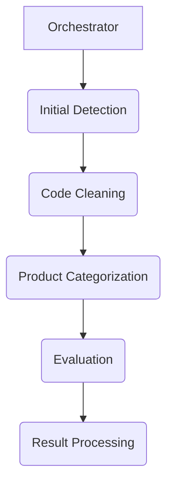
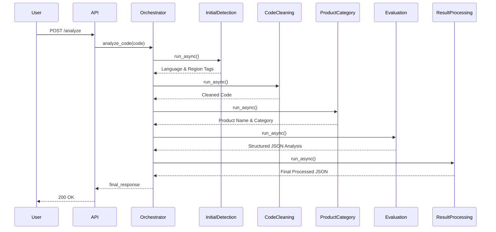

# Technical Design Document: Health Scoring Agent

## 1. Introduction

This document provides a detailed technical overview of the Health Scoring Agent, a multi-agent system for code analysis. It covers the system architecture, the design of the individual agents, the data models used, the prompt engineering strategy, and the API/UI.

## 2. System Architecture

The Health Scoring Agent is built on a modular, multi-agent architecture using the Google Agent Development Kit (ADK). The system is designed as a sequential pipeline of agents, with some steps in the pipeline executing in parallel to improve performance.

The main components of the system are:

*   **Orchestrator:** The central component that manages the workflow and coordinates the execution of the other agents.
*   **Agents:** A collection of specialized agents, each responsible for a specific aspect of the analysis.
*   **Prompts:** A collection of meticulously engineered prompt templates that are used to guide the large language models.
*   **Tools:** A set of tools and utilities that are used by the agents to perform their tasks.
*   **API:** A FastAPI application that provides a REST API for analyzing code samples.
*   **UI:** A simple web interface for submitting code samples for analysis.



### 2.1. Workflow

The analysis workflow is managed by the `CodeAnalyzerOrchestrator` and proceeds as follows:

1.  **Initial Detection (Parallel):**
    *   `DeterministicLanguageDetectionAgent`: Detects the programming language of the code sample using deterministic logic.
    *   `DeterministicRegionTagAgent`: Extracts region tags from the code sample using deterministic logic.

2.  **Code Cleaning:**
    *   `CodeCleaningAgent`: Removes comments from the code to focus the analysis on executable logic.

3.  **Product Categorization:**
    *   `ProductCategorizationAgent`: Categorizes the code sample into a specific Google Cloud product using a combination of a local search index and an LLM fallback.

4.  **Evaluation (Sequential):**
    *   `InitialAnalysisAgent`: Performs a detailed, free-form analysis of the code against multiple criteria using a comprehensive prompt.
    *   `JsonFormattingAgent`: Converts the free-form text analysis from the previous step into a structured JSON object based on a strict schema.

5.  **Result Processing:**
    *   `ResultProcessingAgent`: Processes the final JSON, enforces the "single penalty" rule to deduplicate recommendations, and combines all data into the final output.



## 3. Agent Design

Each agent is a self-contained component. Communication occurs through a shared session state managed by the orchestrator.

### 3.1. Orchestrator

The `CodeAnalyzerOrchestrator` is a `SequentialAgent` that defines the primary workflow.

### 3.2. Initial Agents

*   **`DeterministicLanguageDetectionAgent`**: A `BaseAgent` that uses the `pygments` library to identify the language, avoiding an LLM call for a deterministic task.
*   **`DeterministicRegionTagAgent`**: A `BaseAgent` that uses regular expressions to find region tags, also avoiding an LLM call.
*   **`CodeCleaningAgent`**: A simple utility agent.
*   **`ProductCategorizationAgent`**: A `BaseAgent` that uses a sophisticated local search mechanism before falling back to an `LlmAgent` if needed.

### 3.3. Evaluation Agents

*   **`InitialAnalysisAgent`**: An `LlmAgent` that uses the `consolidated_eval.md` and `system_instructions.md` prompts to generate a comprehensive, unstructured review. It is recommended to use the Gemini Pro model for this task for higher quality analysis.
*   **`JsonFormattingAgent`**: An `LlmAgent` that takes the output of the `InitialAnalysisAgent` and structures it according to the schema in `json_conversion.md`. It is recommended to use the Gemini Flash model for this task, as it is a less complex formatting task.

### 3.4. Result Processing Agent

The `ResultProcessingAgent` is a `BaseAgent` that performs final data cleaning and aggregation. Its most important function is to enforce the single penalty hierarchy, which prevents redundant recommendations from appearing in the final output.

## 4. Prompt Engineering

The quality of the analysis is highly dependent on the quality of the prompts. This system employs a sophisticated prompt engineering strategy.

*   **Persona-driven Prompts:** Prompts assign a specific, expert persona to the LLM (e.g., "You are a senior DevOps engineer," "You are a principal engineer at a major tech company"). This focuses the LLM on the specific context and requirements of the task.
*   **Structured Instructions:** Prompts provide clear, detailed, and itemized instructions on what to analyze. For example, instead of asking for "code quality," the prompt specifies checks for formatting, naming conventions, complexity, and language best practices.
*   **Schema Enforcement:** Prompts that require structured output, such as JSON, include a clear and detailed schema within the prompt itself. This dramatically improves the reliability and consistency of the LLM's output, making it programmatically usable.

## 5. Data Models

The system uses Pydantic models to define the expected structure of the final JSON output. The key model is `EvaluationOutput`, which is enforced by the `JsonFormattingAgent`. Other prompts for sub-agents (like `runnability_prompt.md`) also define their own JSON schemas, which are then consolidated into the final `EvaluationOutput`.

### 5.1. `EvaluationOutput` Schema

This model, defined in `json_conversion.md`, structures the final analysis.

```json
{
  "overall_compliance_score": "integer (0-100)",
  "criteria_breakdown": [
    {
      "criterion_name": "'runnability_and_configuration' | 'api_effectiveness_and_correctness' | ...",
      "score": "integer (0-100)",
      "weight": "float",
      "assessment": "Union[str, RunnabilityChecks, List[ApiCallAnalysis]]",
      "recommendations_for_llm_fix": ["string"],
      "generic_problem_categories": ["string"]
    }
  ],
  "llm_fix_summary_for_code_generation": ["string"],
  "identified_generic_problem_categories": ["string"],
  "citations": [
    {
      "citation_number": "integer",
      "url": "string"
    }
  ]
}
```

## 6. API

The system provides a REST API for analyzing code samples. The API is built using FastAPI and is defined in the `api/main.py` file.

### 6.1. `POST /analyze`

Analyzes a code sample and returns a detailed analysis of its health.

**Request Body:**

*   `code` (string, required): The code sample to analyze.
*   `github_link` (string, optional): The GitHub link to the code sample.

### 6.2. `POST /analyze_github_link`

Analyzes a code sample from a GitHub link and returns a detailed analysis of its health.

**Request Body:**

*   `github_link` (string, required): The GitHub link to the code sample.

## 7. UI

The system includes a simple web interface for submitting code samples for analysis. The UI is built using HTML, CSS, and JavaScript and is defined in the `api/ui` directory. The UI allows users to enter a GitHub link to a code sample and view the results of the analysis.